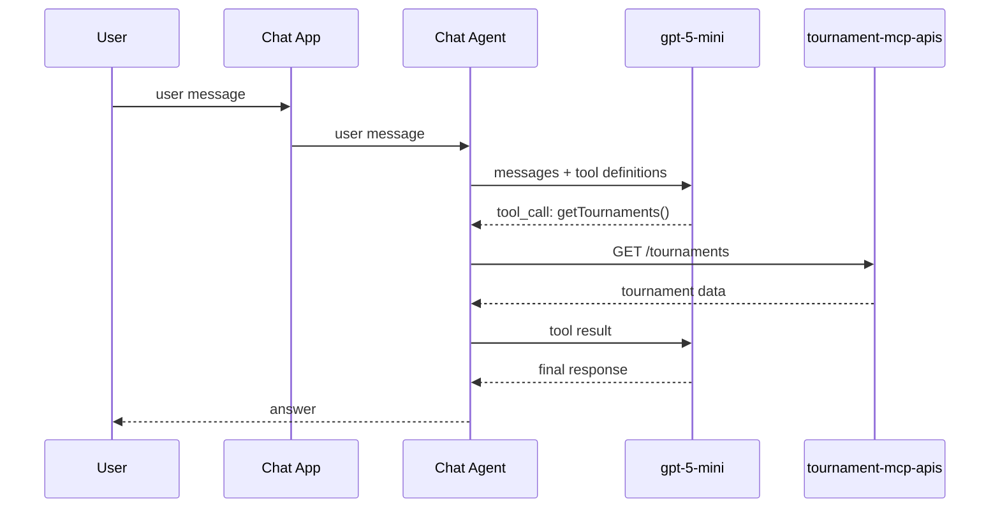
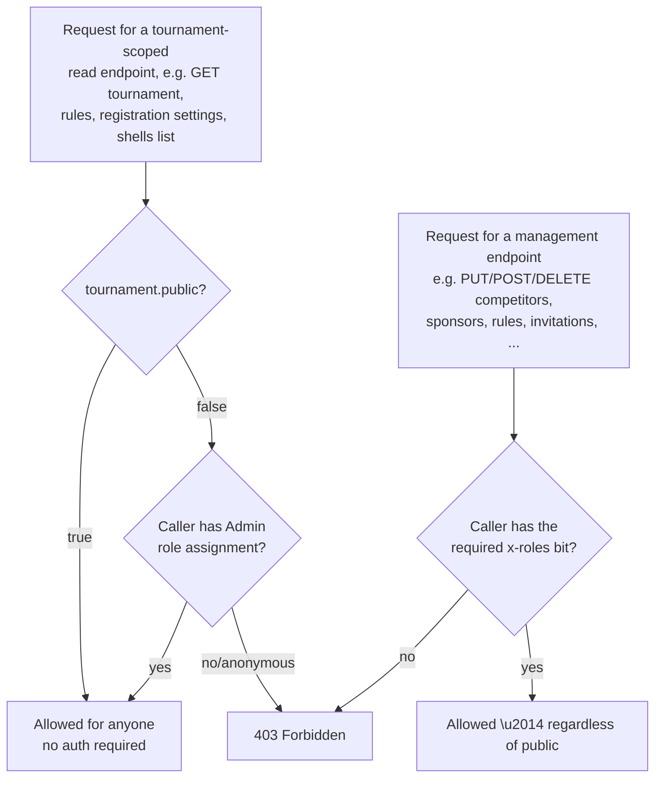
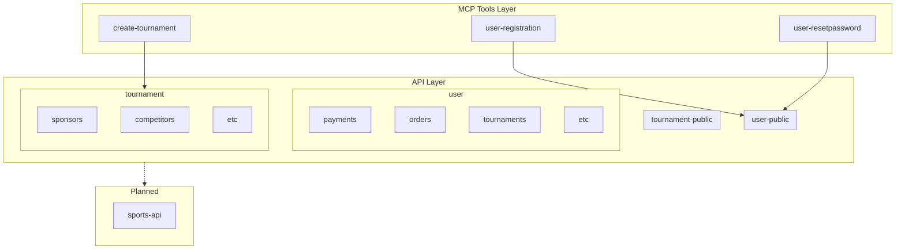
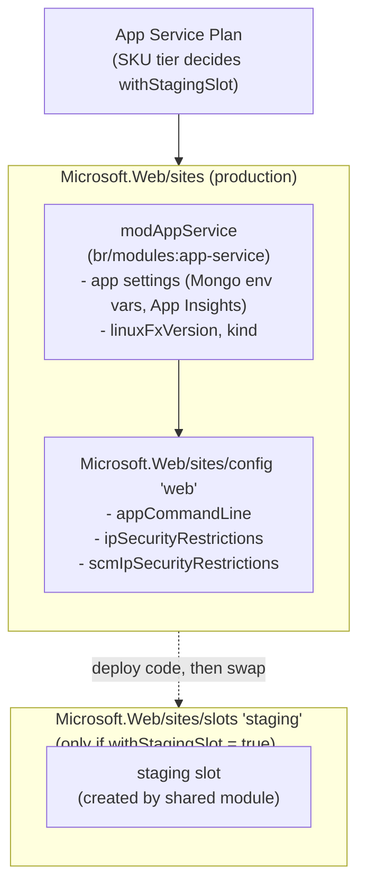
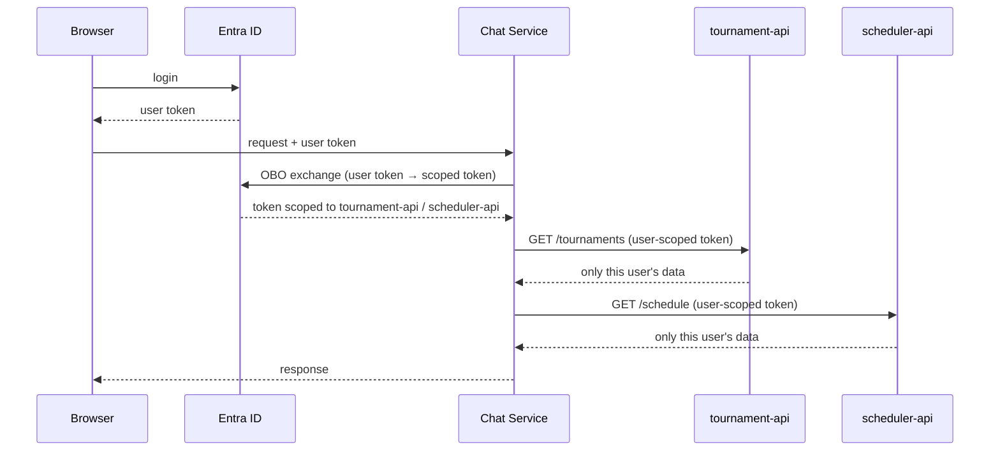

# FCToernooi ChatApp

Chat assistant that helps logged-in users manage tournaments using the tournament-mcp-apis.


## Architecture



The LLM decides when to call a tool based on the user's question. The chat service executes the actual API call and returns the result to the LLM, which then formulates the response.

## Authorization Model

Tournament access is governed by `Tournament.public` plus per-tournament role assignments — there are **no global user roles**, only roles scoped to a tournament via `TournamentRoleAssignment`.

### Roles

Bitmask values, sourced from `fctoernooi-api`'s `domain/Role.php` (source of truth — keep in sync, do not redefine independently):

| Role | Bit | Grants (management actions) |
|---|---|---|
| `Admin` | 1 | Everything: tournament settings, competitors, sponsors, locker rooms, recesses, rules, and (as the only role that can access a non-public tournament at all) viewing/using it when `public === false` |
| `RoleAdmin` | 2 | Manage tournament role assignments and invitations; manage registrations (list/accept/decline) |
| `GameResultAdmin` | 4 | Reserved for game-result management (not yet ported from `fctoernooi-api`) |
| `Referee` | 8 | Reserved for referee-scoped game-result edits (not yet ported from `fctoernooi-api`) |

A user can hold any combination of these bits per tournament, expressed as one `TournamentRoleAssignment.roles` integer.

### Visibility — `Tournament.public`

`Tournament.public: boolean`, **defaults to `true`** when a tournament is created.



- `public === true`: the tournament, its rules, registration settings, and shells listing are readable by anyone (no auth), and anyone can submit a registration to it.
- `public === false`: only a caller holding the `Admin` role assignment for that tournament may view or use it at all — no other role, and no anonymous access.
- **Management actions never become open just because a tournament is public.** Creating/editing/deleting competitors, sponsors, locker rooms, recesses, rules, invitations, registrations (list/accept/decline), registration settings, tournament PUT/DELETE, and role assignments always require their specific role bit (declared per-operation via the `x-roles` vendor extension in `openapi.yaml`), independent of the `public` flag.

### Data model invariant

`TournamentRoleAssignment` is the **only** link between a `User` and a `Tournament` (fields: `tournamentId`, `userId`, `roles` bitmask). `Tournament` itself never carries a direct `userId`/owner field — every access path goes through this join. A tournament always has at least one `Admin` assignment, created atomically alongside the tournament itself (no tournament can exist without an admin).

### Enforcement

`openapi.yaml` has no `/public/*` path prefix — the split shown in the old PHP API (`fctoernooi-api-old`) was purely a URL convention and is not needed anymore now that visibility is driven entirely by the `public`/role rules above. `x-roles` per operation in `openapi.yaml` documents the required role for management endpoints; `source/backend/src/server.ts` enforces it with explicit inline `getTournamentRoleAssignment`/`hasRole` checks per handler (matching the rest of the codebase's style, not a generic spec-reading middleware). The general public/private visibility rule (endpoints with no `x-roles`) is applied via a shared `canViewNonPublicTournament(tournamentId, userId)` helper, called explicitly from each affected handler (tournament GET, rules GET, registration-settings GET, registration submit).

## Component List
|name|function|
|-|-|
|User|Logged-in tournament organizer/user interacting with the assistant|
|Chat App|Frontend UI that sits between the user and the agent|
|Chat Agent|Backend service that orchestrates the conversation, calls the LLM and invokes API tools|
|gpt-5-mini|LLM that interprets user intent and decides which tool to call|
|tournament-mcp-apis|MCP layer exposing tournament/user tools on top of the underlying APIs|


## Tournament MCP APIs

`tournament-mcp-apis` is an MCP layer sitting on top of the existing API layer. MCP tools are the only thing the LLM ever calls — each tool internally invokes one or more of the underlying APIs.



| Layer | Item | Notes |
|---|---|---|
| MCP tool | `user-registration` | Registers a new user via `user-public` |
| MCP tool | `user-resetpassword` | Resets a user's password via `user-public` |
| MCP tool | `create-tournament` | Creates a tournament via `tournament` |
| API | `user-public` | Unauthenticated user actions (registration, password reset) |
| API | `tournament-public` | Unauthenticated tournament read endpoints |
| API | `user` | Authenticated user endpoints — payments, orders, tournaments, etc. |
| API | `tournament` | Authenticated tournament endpoints — sponsors, competitors, etc. |
| Planned | `sports-api` | Not yet implemented |

## ProjectDetails - Technical

| Section | Bicep / command | Resources |
|---|---|---|
| **Infra** | `infra/main.bicep` + `infra/parameters.json` (env-specific values passed as extra `--parameters key=value` overrides in CI) | App Service Plan (`rg-fctoernooi-<env>`), backend App Service (APIM-restricted), frontend App Service, APIM backend + API + product (in `rg-core-<env>`) |
| **Source — backend** | `az webapp deploy` → staging slot → swap | `as-fctoernooi-api-<env>` |
| **Source — frontend** | `az webapp deploy` → staging slot → swap | `as-fctoernooi-frontend-<env>` |

#### App Service / Slot / Config relationship

`infra/modules/app-service.bicep` wraps the shared `br/modules:app-service` module, then attaches a `config` (`web`) child resource for settings the shared module doesn't expose as parameters. The staging slot only exists when the plan tier is `Standard` (`withStagingSlot`) and does not get its own `config` resource here — it inherits the site-level config until swapped.



## API's


####  Keys & Secrets
All keys live in the **backend chat service** — never in the browser.

| Secret | Storage |
|---|---|
| Azure OpenAI `api-key` | Azure Key Vault → env var |
| tournament-api key | Azure Key Vault → env var |
| scheduler-api key | Azure Key Vault → env var |
| Local dev | `.env` file (gitignored) |
| GitHub Actions | GitHub Secrets |

## CI/CD Pipeline

#### Triggers & environment flow

**push to non-main branch**


#### Trigger rules

| Event | Condition | Environment |
|---|---|---|
| `push` | any branch except `main` | dev |
| `pull_request` closed | `merged == true` into `main` | acc |
| after acc succeeds | — | prd |


## User Privacy & Data Isolation

The chat service must call the tournament-api and scheduler-api **in the name of the logged-in user** using the OAuth On-Behalf-Of (OBO) flow. Data filtering is enforced at the API level — never by the LLM.



**Rules:**
- The tournament-api and scheduler-api validate the bearer token and only return data owned by that user (`oid`/`sub` claim)
- The LLM never sees tokens or keys
- Even a prompt injection attack cannot access another user's data — the token has no permission for it

## Infrastructure

Azure AIServices (`kind: 'AIServices'`) deployed via Bicep + GitHub Actions.

**Endpoint pattern:**
```
https://aoai-fctoernooi-{env}.cognitiveservices.azure.com/openai/v1/chat/completions?api-version=2025-04-01-preview
```

Environments: `dev` (capacity 10) · `acc` (capacity 20) · `prd` (capacity 50)


## Approach: Function Calling (Tool Use)

The assistant uses **function calling** — not RAG or fine-tuning — because it needs live data from APIs.

| Approach | Verdict |
|---|---|
| Function calling / tools | Live API data, actions |
