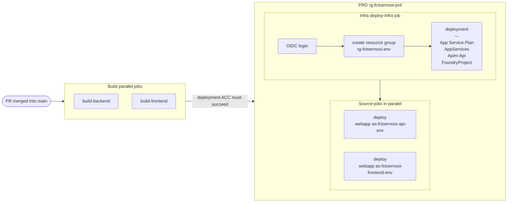
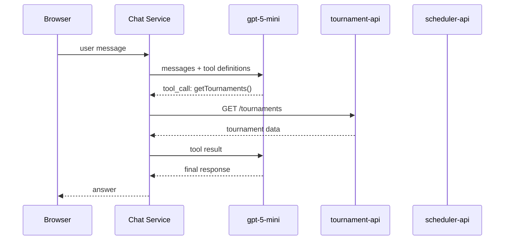
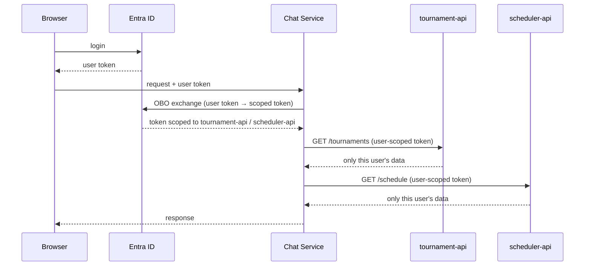

# fctoernooi-llm

Chat assistant that helps logged-in users manage tournaments using the tournament-api and scheduler-api.

## CI/CD Pipeline

### Triggers & environment flow

**push to non-main branch**



### Trigger rules

| Event | Condition | Environment |
|---|---|---|
| `push` | any branch except `main` | dev |
| `pull_request` closed | `merged == true` into `main` | acc |
| after acc succeeds | — | prd |

### Infra vs source — what each deploys

| Section | Bicep / command | Resources |
|---|---|---|
| **Infra** | `infra/main.bicep` + `parameters/<env>.json` | App Service Plan (`rg-fctoernooi-<env>`), backend App Service (APIM-restricted), frontend App Service, APIM backend + API + product (in `rg-core-<env>`) |
| **Source — backend** | `az webapp deploy` → staging slot → swap | `as-fctoernooi-api-<env>` |
| **Source — frontend** | `az webapp deploy` → staging slot → swap | `as-fctoernooi-frontend-<env>` |


## Architecture

### Approach: Function Calling (Tool Use)

The assistant uses **function calling** — not RAG or fine-tuning — because it needs live data from APIs.

| Approach | Verdict |
|---|---|
| Function calling / tools | ✅ Live API data, actions |

### Component Overview



The LLM decides when to call a tool based on the user's question. The chat service executes the actual API call and returns the result to the LLM, which then formulates the response.

### API Keys & Secrets

All keys live in the **backend chat service** — never in the browser.

| Secret | Storage |
|---|---|
| Azure OpenAI `api-key` | Azure Key Vault → env var |
| tournament-api key | Azure Key Vault → env var |
| scheduler-api key | Azure Key Vault → env var |
| Local dev | `.env` file (gitignored) |
| GitHub Actions | GitHub Secrets |

### User Privacy & Data Isolation

The chat service must call the tournament-api and scheduler-api **in the name of the logged-in user** using the OAuth On-Behalf-Of (OBO) flow. Data filtering is enforced at the API level — never by the LLM.



**Rules:**
- The tournament-api and scheduler-api validate the bearer token and only return data owned by that user (`oid`/`sub` claim)
- The LLM never sees tokens or keys
- Even a prompt injection attack cannot access another user's data — the token has no permission for it

## Infrastructure

Azure AIServices (`kind: 'AIServices'`) deployed via Bicep + GitHub Actions.

**Endpoint pattern:**
```
https://aoai-fctoernooi-{env}.cognitiveservices.azure.com/openai/v1/chat/completions?api-version=2025-04-01-preview
```

Environments: `dev` (capacity 10) · `acc` (capacity 20) · `prd` (capacity 50)
